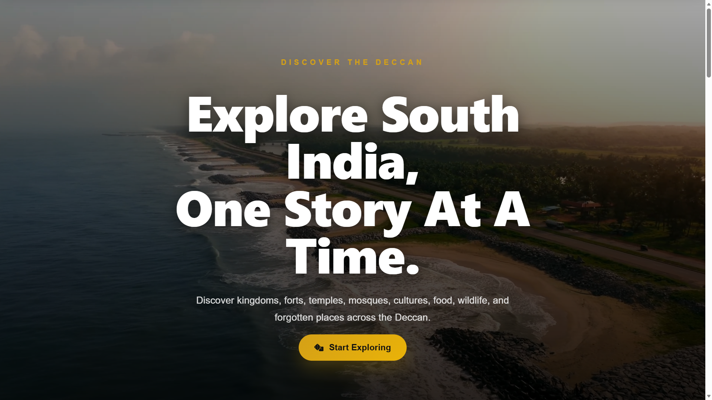
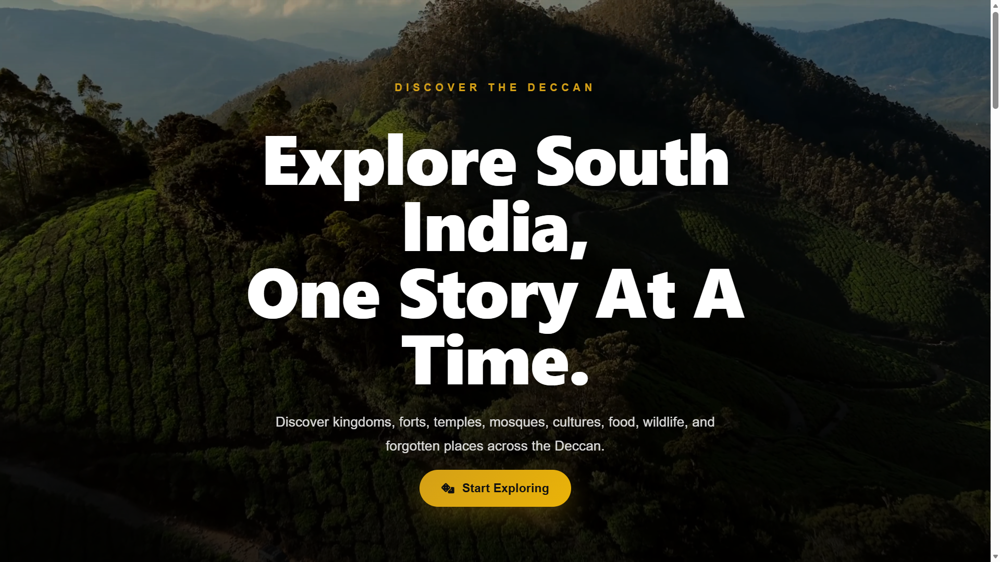
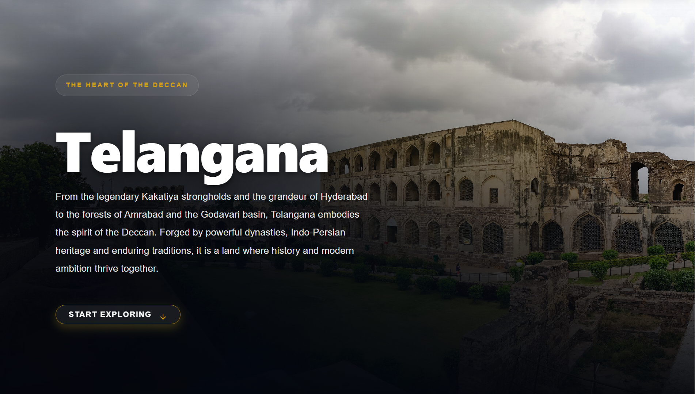
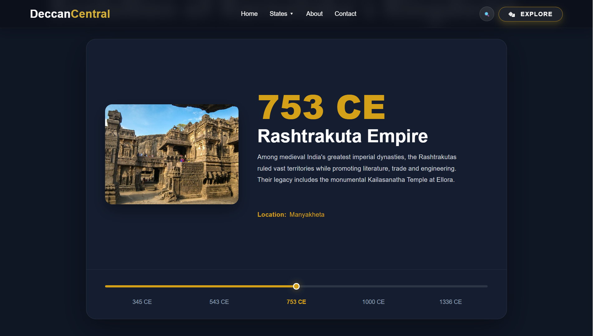
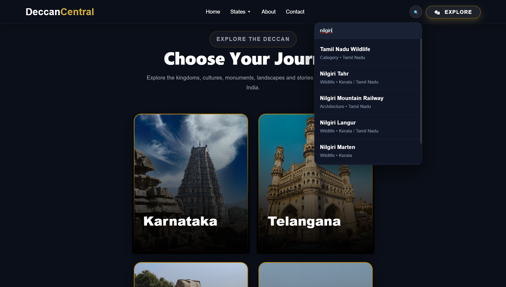
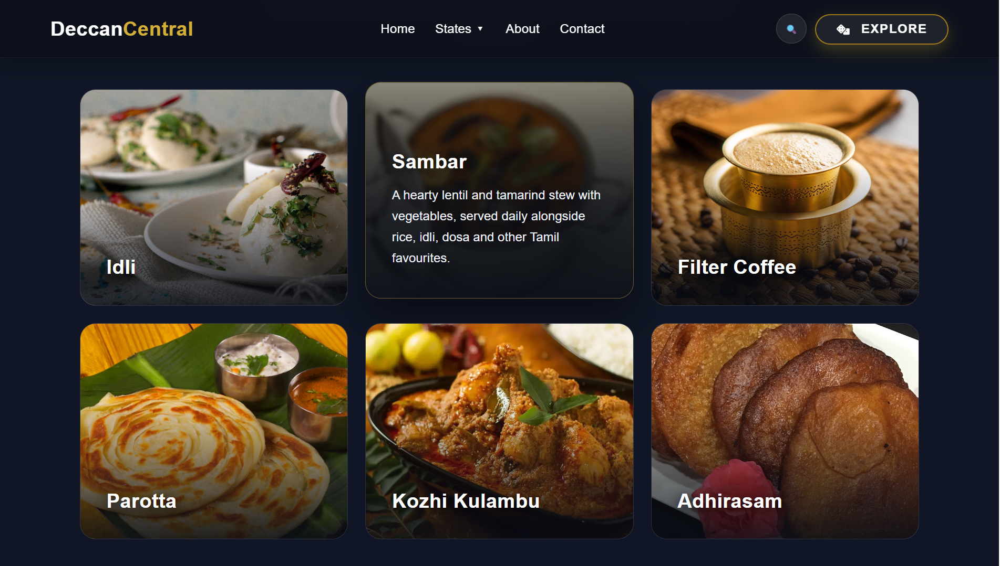

# Deccan Central

> An immersive platform exploring the history, architecture, culture, wildlife, cuisine, and living heritage of South India.

<p align="center">
  
</p>

---

## 🏛️ Overview

Deccan Central is a cinematic web application built to document and celebrate the rich heritage of South India. Rather than functioning as a travel guide, it presents the Deccan as a living civilization through immersive storytelling, historical timelines, curated galleries, and interactive experiences.

The platform brings together the **history, kingdoms, architecture, monuments, cuisine, wildlife, festivals, traditions, personalities, literature, and living heritage** of **Karnataka, Kerala, Tamil Nadu, Telangana, and Andhra Pradesh** into a single modern web experience.

Designed as a digital knowledge platform, Deccan Central encourages exploration through carefully curated content, interactive navigation, and a visually immersive interface.

---

## ✨ Highlights

- 🏛️ Explore all five South Indian states
- 👑 Discover kingdoms and dynasties
- 🕰️ Interactive historical timelines
- 🏯 Architecture, monuments, and heritage sites
- 🌿 Wildlife and biodiversity
- 🍛 Regional cuisine and culinary traditions
- 🎭 Festivals, culture, and living traditions
- 📚 Curated historical and cultural content
- 🖼️ Responsive image galleries
- 🎨 State-specific visual themes
- 🔍 Smart search with aliases across states and categories
- 📱 Fully responsive design
- ✨ Cinematic UI powered by React Bits and Motion

---

## 🚀 Tech Stack

| Category | Technologies |
|----------|--------------|
| Frontend | React 19, Vite |
| Routing | React Router |
| Styling | CSS3 |
| UI Components | React Bits |
| Animation | Motion |
| Icons | Lucide React |
| Language | JavaScript (ES6+) |

---

## 📂 Project Structure

```text
src
├── assets
├── components
├── data
├── pages
├── App.jsx
├── main.jsx
└── index.css
```

---

## ⚡ Getting Started

### Clone the repository

```bash
git clone https://github.com/sameer-khan-a/Deccan-Central.git
```

### Navigate into the project

```bash
cd Deccan-Central
```

### Install dependencies

```bash
npm install
```

### Start the development server

```bash
npm run dev
```

### Build for production

```bash
npm run build
```

---

## 📸 Screenshots

### 🏠 Home



---

### 🏛️ State Page



---

### 🕰️ Historical Timeline



---

### 🔍 Smart Search



---

### 🖼️ Gallery



---

## 🛣️ Roadmap

- [x] Home page
- [x] Five state pages
- [x] Category pages
- [x] Interactive historical timelines
- [x] Smart search
- [x] Responsive design
- [x] Responsive image galleries
- [x] State-specific themes
- [x] Live deployment
- [ ] Interactive heritage maps
- [ ] Personalized bookmarks
- [ ] Multilingual support
- [ ] Accessibility improvements
- [ ] Performance optimization

---

## 💡 Why Deccan Central?

While many platforms focus primarily on tourism, **Deccan Central** explores South India through its history, kingdoms, architecture, wildlife, cuisine, literature, traditions, and cultural evolution.

Rather than simply showcasing destinations, the platform is designed as a **modern digital knowledge platform** that documents, preserves, and celebrates one of the world's richest and most diverse civilizations through an immersive web experience.

---

## 🤝 Contributing

Contributions, suggestions, and improvements are welcome.

1. Fork the repository.
2. Create a new feature branch.
3. Commit your changes.
4. Open a Pull Request.

---

## 👨‍💻 Author

**Sameer Khan**

If you found this project interesting, consider giving it a ⭐ to support its development.
